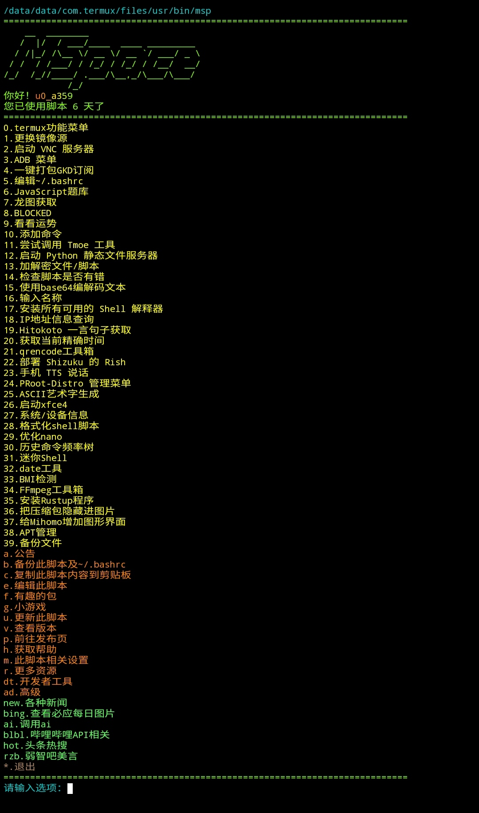

# MSpace

作者：Wangxia

MSp / MSpace / Menu Space / 菜单空间

**旨在为用户创造快捷方便自动化的termux**

## 安装
``` Shell
curl -s https://gh-proxy.org/raw.githubusercontent.com/openwang6892/MSpace/refs/heads/main/installer/install.sh | bash
```
跟着提示一步步来
就这么简单！安装完成后输入`msp`立即开始

## 截图及演示


## 功能
1. 有趣的软件包
2. 彩虹用户名
3. ffmpeg工具箱
4. APT管理
5. termux功能菜单
6. 系统信息
7. 随机龙图
8. JS题库
9. 终端使用Shizuku
10. 新闻
11. 多种资源

*任你使用*

## 其他
MSpace**仅支持**bash，请勿使用其他解释器运行

建议只在**Termux**运行MSp

## 许可证
本项目采用 [MIT 许可证](LICENSE) 开源，允许自由阅读、复制、修改和分发。

## 贡献
本项目**不接受 Pull Request**。如有建议或意见，请通过** Issues **提出。
贡献者：wangxia155 为作者的其他账号
